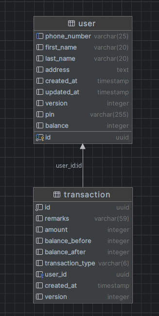

# Bank Management System

This project is the backend component of bank management system, implemented using Docker, Go, Postgresql and kafka. It provides a reliable and efficient backend system for library management system, more manageable ones.
High decopling also undirectly achived by utilizing asyncronous way.

## MVP Features

- User Management
- Bank Management

## Application Project Structure

For bank-backend service i am using go monolith from [BUKA 2.0 reference](https://bukalapak.atlassian.net/wiki/spaces/CIS/pages/2216108710/RFC+Go+Monolith+Project+Structure) with some modifications.
Description on each folder is like this:

- cmd/: Stores all entry points to the services that are run within this project.
- internal/
  - config/: Initialises application and performs dependency injection into all modules.
  - utils/: Example of some helpers that can be used across modules.
- module/: Stores all the modules within this project. Each sub-directory in this folder should be self-contained. Module A should communicate with module B using B’s client package.
  - bank/: Stores all needed files in the bank module. Each file can be named like `entity` which means contains entity of the module. `usecase` which means usecase layer. `repository` which means repository layer. etc
- tools/: is tools that needed for building. Maybe some shell script, etc

## Prerequisites

Make sure you have the following prerequisites installed:

- Docker (version >= 27.1.2)
- Docker Compose (version >= v1.29.2)

## Configuration

Modified Create `app.yml` file to in config directory. `app.yml` supposed to be like this:

```
server:
  port: 8080
  read_timeout: 1
  write_timeout: 1

db:
  host: localhost
  port: 5433
  user: postgres
  password: yoontae93
  db_name: bank_db
  ssl_mode: disable
  min_conn: 5
  max_conn: 1000

kafka:
  broker: localhost:9092

process_transfer_topic: bank.transfer_created

```

## How To Run

#### 1. Docker Compose:

Thanks to docker-compose.

1. Clone repo

```
git clone https://github.com/farhandwian/bank-be.git
```

2. Suppose you are in root folder. running docker compose up command:

```
docker-compose up -d
```

3. Execute sql migration file `sql_dum.sql` on migration folder:

```
cd /migration

// excute sql_dump
```

#### 1. Also Fun Way:

build binary

1. Clone repo

```
git clone https://github.com/farhandwian/bank-be.git
```

2. Go to service folder

```
cd belajar-untuk-kerja/aplikasi-bank/bank-be/bank-backend
```

3. Build Binary

```
go build .
```

4. Execute Binary

```
./belajar-untuk-kerja/aplikasi-bank/bank-be/bank-backend serve-http
```

note: belajar-untuk-kerja/aplikasi-bank/bank-be/bank-backend has argument `serve-http` and bank-worker has argument `serve`

5. Execute sql migration file `sql_dump.sql` on migration folder:

```
cd migration

// excute sql_dump.sql
```

### Data Migration:

`sql_dump.sql` contain DDL sql to build db schema. since there are no pre-required data, you can try the system as soon as possible start with registering account.

## API USAGE

The backend component provides the API endpoints for Bank Management System. To interact with the backend, you
can use an API testing tool such as Postman.

Import postman collection which can be found in root folder project to your Postman.

## ERD


